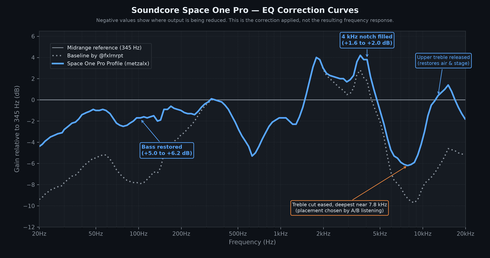
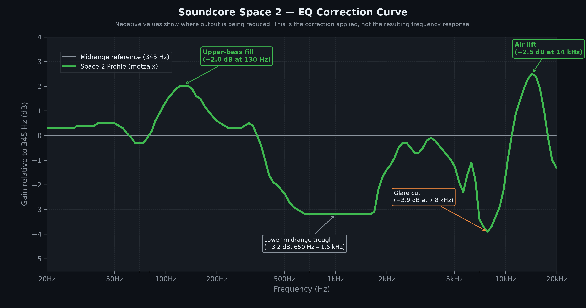

# Wavelet AutoEq Profiles

Custom AutoEq / GraphicEQ equalization profiles optimized for **[Wavelet](https://play.google.com/store/apps/details?id=com.pittvandewitt.wavelet)** on Android.

> **Tuning Goal:** Slightly bass-forward with sub-bass kept in check, lower mids pulled back so bass doesn't cloud vocals, and lower-treble glare reduced for long sessions. How close each profile gets depends on the driver; see the per-model notes. If you want a neutral or target-curve sound, these profiles aren't aimed at that.

---

## 🎧 Supported Models

| Manufacturer | Model | Description | Tuning Approach | Type | Profile |
| :--- | :--- | :--- | :--- | :--- | :--- |
| **Anker** | [Soundcore Space One Pro](#-soundcore-space-one-pro) | Bass-heavy stock | Restores +5 to +6 dB bass vs. the baseline; eases its treble cut and releases the upper treble; fills the 4 kHz notch | Equalizer APO GraphicEQ | [Download](Anker/Soundcore%20Space%20One%20Pro/Soundcore%20Space%20One%20Pro.txt) |
| **Anker** | [Soundcore Space 2](#-soundcore-space-2) | Mild stock glare; lean 100–130 Hz | Upper-bass fill at 130 Hz; narrow −3.9 dB glare cut at 7.8 kHz; shallow overall to avoid driver strain | Equalizer APO GraphicEQ | [Download](Anker/Soundcore%20Space%202/Soundcore%20Space%202.txt) |

> 💡 *Click on any model name above to jump to its detailed sound profile and tuning analysis.*

---

## 🎯 Profile Details & Tuning Analysis

These profiles were developed by ear on personal units to fix specific listening pain points.

---

### 🎧 Soundcore Space One Pro

* **Stock Sound:** Bass-heavy out of the box, with significant sub-bass over-emphasis and a mid-bass hump around 80–100 Hz. The SoundGuys B&K 5128 measurement, shown in both their [review](https://www.soundguys.com/anker-soundcore-space-one-pro-review-124002/) and their [Space 2 vs Space One Pro comparison](https://www.soundguys.com/soundcore-space-2-vs-space-one-pro-does-the-budget-model-beat-the-pro-156826/), has a dip near 4 kHz and an intense spike at about 6 kHz. The treble choices below were settled by listening rather than by following that spike exactly.
* **Tuning Method:** Tuned by ear on a personal unit, adapted from the baseline profile by [@fxlrnrpt](https://gist.github.com/fxlrnrpt/58d2eb6b1a84451456624e87d48762c5), then cross-checked against the SoundGuys measurement. Where measurement and listening disagreed on treble placement, listening decided. Preference decisions in the bass were kept deliberately, not corrected toward any target curve.
* **What This Profile Changes vs. The Baseline by [@fxlrnrpt](https://gist.github.com/fxlrnrpt/58d2eb6b1a84451456624e87d48762c5):**
  * **Restored Bass (+5.0 dB to +6.2 dB):** The baseline flattened the low end very aggressively. This curve adds back sub-bass and mid-bass — +5.0 dB at 20 Hz, peaking at +6.2 dB near 100 Hz — for weight and punch. Note that this deliberately leaves some of the stock mid-bass hump in place; it is a preference choice, not a correction.
  * **Midrange Inherited Unmodified (345 Hz – 1.9 kHz):** Carried over from the baseline without changes. This region includes a −5.3 dB scoop centred at 630 Hz and a +4.0 dB peak at 1.8 kHz, both relative to the 345 Hz reference. Neither was derived from the measurement — they come from the baseline — but both line up with it: the SoundGuys measurement shows a bump near 630 Hz and a dip near 1.8 kHz relative to its target. Both were also tested and kept. Filling the 630 Hz scoop was tried and reverted: it made the low end sound less full-bodied, because the bass sits roughly 4 dB above that trough and loses the contrast when it's filled, and it added a congested quality to close-mic'd vocals. The 1.8 kHz peak is left in place; it is a significant part of this profile's vocal presence.
  * **4 kHz Notch Filled (+1.6 to +2.0 dB):** The SoundGuys review measurement shows a real dip near 4 kHz that the baseline did not address. Filling it restores articulation on cymbal attack, string texture and piano upper registers.
  * **Treble Cut Eased (+1.0 to +4.9 dB, 4.8–10.3 kHz):** Makes the baseline's treble cut shallower and moves its deepest point from 8.7 kHz down to 7.8 kHz, part of the way toward the 6 kHz spike in the SoundGuys measurement. Three placements were A/B tested on this unit with ANC on: deepest cut at 6.3 kHz (on the spike), at the baseline's 8.7 kHz, and halfway between. The 8.7 kHz version gave slightly more texture on brushed drums; this halfway version sounded more breathable and worked better across genres.
  * **Upper Treble Released (+5.5 to +6.8 dB, 11–16 kHz):** Following from the above, the baseline attenuates a region that the SoundGuys review measurement shows as already at or below target. Releasing it restores air and perceived soundstage.
  * *Relative to the 345 Hz midrange reference, the resulting curve sits roughly 1–2.5 dB down across the bass (falling to about −4.4 dB at 20 Hz), +4 dB at 1.8 kHz, +2 to +4 dB through 3.4–4.3 kHz, −5.3 dB at 6.3 kHz, about −6 dB from 7 to 8.7 kHz (deepest at 7.8 kHz), and approximately level from 11.5 kHz upward.*
* **Caveats:** Tuned by ear on one unit, on one head, with ANC enabled. SoundGuys lists this Nominal measurement separately from an ANC-off measurement of the same headphone. The treble changes above 3 kHz were confirmed by listening — brushed drums and live-room ambience for the upper treble, upper-register piano for the 4 kHz fill, and bright close-mic'd vocals as a sibilance check. The 4 kHz fill remains the least transferable adjustment here: narrow features in that region vary considerably between individuals, so if the profile sounds shouty on loud vocals, that band is the first thing to reduce.
* **Profile File:** [`Soundcore Space One Pro.txt`](Anker/Soundcore%20Space%20One%20Pro/Soundcore%20Space%20One%20Pro.txt)
* **Attribution:** Baseline curve created by [@fxlrnrpt](https://gist.github.com/fxlrnrpt/58d2eb6b1a84451456624e87d48762c5). Measurement references: SoundGuys [review](https://www.soundguys.com/anker-soundcore-space-one-pro-review-124002/) and [Space 2 vs Space One Pro comparison](https://www.soundguys.com/soundcore-space-2-vs-space-one-pro-does-the-budget-model-beat-the-pro-156826/).

[Back to top ↑](#-supported-models)

---

### 🎧 Soundcore Space 2

* **Stock Sound:** A dip through the upper bass (deepest around 130 Hz) and a treble peak around 7–8 kHz that shows up as sharpness on consonants and plucked strings.
* **Tuning Method:** No AutoEq database entry exists for this model. The curve was derived by translating the Space One Pro profile through SoundGuys' published frequency response measurements of both headphones, then corrected by ear over several rounds on a personal unit. A later round used SoundGuys' measurement data to re-centre the bass fill and the glare cut, each confirmed by A/B listening. All figures below are relative to the 345 Hz midrange reference, not raw file values.
* **What This Profile Does:**
  * **Upper-bass fill (+2.0 dB at 120–135 Hz):** Centred on the dip in the stock response, which is deepest around 130 Hz, with 63–78 Hz kept just below the reference. Earlier, broader fills also lifted the low bass and sounded boomy on this unit; centring the fill on the dip was preferred in A/B listening.
  * **Lower midrange at −3.2 dB (650 Hz – 1.6 kHz):** A broad, shallow trough. Deeper versions made acoustic material sound bass-forward and unbalanced; a shallower version sounded slightly muddy.
  * **Glare reduction (−3.9 dB at 7.8 kHz):** A narrow cut on the stock treble peak (7–8.7 kHz), with a lighter −1.1 to −2.3 dB through 5–6.6 kHz, where the stock response is less elevated. An earlier wide cut across 6–8 kHz was bracketed from both directions: going deeper audibly removed brushed-cymbal texture, and removing it brought back sharpness on consonants. Narrowing the cut onto the peak let it go deeper without that loss.
  * **Air lift (+2.5 dB at 14 kHz):** Compensates the steep rolloff above 10 kHz.
  * **Design constraint — keep the curve shallow:** On this driver, deep cuts force a large volume compensation, which produces audible roughness on guitar transients. Total range is held to 6.4 dB for that reason. Earlier versions at 12 dB range were clearly worse. Anyone adapting this curve should treat total depth as a budget rather than adding corrections freely.
  * **Not a Harman profile:** The 2–3 kHz ear-gain region sits several dB below standard targets, and the bass is close to neutral rather than shelved. This is a personal tuning, not a target-curve implementation.
* **Caveats:** Tuned by ear on one unit, on one head, with ANC enabled. SoundGuys notes that the Space 2's sound changes with ANC off, so the profile may land differently in other modes.
* **Profile File:** [`Soundcore Space 2.txt`](Anker/Soundcore%20Space%202/Soundcore%20Space%202.txt)
* **Attribution:** Derived from an earlier version of this repo's Space One Pro profile (deepest treble cut at 6.3 kHz), which builds on the baseline curve by [@fxlrnrpt](https://gist.github.com/fxlrnrpt/58d2eb6b1a84451456624e87d48762c5). Measurement reference: [SoundGuys Space 2 vs Space One Pro comparison](https://www.soundguys.com/soundcore-space-2-vs-space-one-pro-does-the-budget-model-beat-the-pro-156826/).

[Back to top ↑](#-supported-models)

---

## 📲 How to Import into Wavelet

1. **Download the Profile**:
   - Tap on the download link above or download the `.txt` file for your headphone model to your Android device.
2. **Open Wavelet**:
   - Ensure **Wavelet** is running and connected to your active audio playback session.
3. **Import AutoEq Profile**:
   - In Wavelet, tap on **AutoEq**.
   - Tap the three dots (menu) or the search bar and select **Import**.
   - Browse your device storage and select the downloaded `.txt` profile.
4. **Activate**:
   - Toggle **AutoEq** to **ON**.

---

## 📌 Note

These profiles are shared as-is for personal use and community reference. You are welcome to download, use, and fork this repository to modify or adapt the curves for your own listening setup.

---

## 📄 License

This repository is distributed under the [MIT License](LICENSE).
